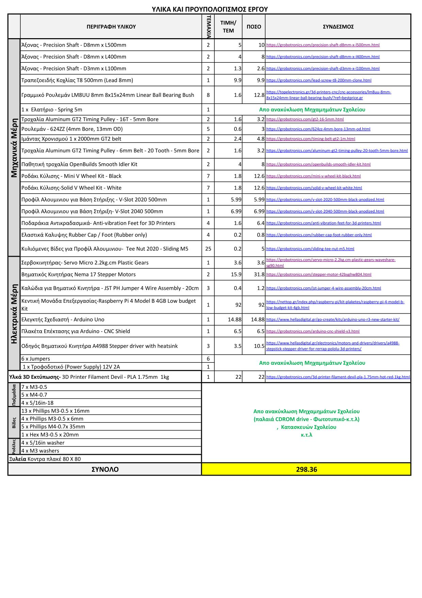

# Recycle-to-Art
Αποθετήριο του σχολείου "Εσπερινό ΕΠΑΛ Αλιάρτου" για στην συμμετοχή στον Διαγωνισμό Ανοιχτών Τεχνολογιών

**Ομάδα:**  " Arts on Scraps " (Οι μαθητές της **Γ πληροφορικής** του Εσπερινού ΕΠΑΛ Αλιάρτου 

**Σχολείο:** Εσπερινό ΕΠΑΛ Αλιάρτου

**Τίτλος έργου:** «Νέα Ζωή-Νέα Πνοή : Μετατρέποντας τα σκουπίδια σε τέχνη»

______

# Εποπτικό Διάγραμμα του Συστήματος

___

______

# ΑΡΧΙΚΗ ΠΡΟΤΑΣΗ ΤΟΥ ΕΡΓΟΥ

___

Παρακάτω περιγράφεται η πρόταση έργου για την συμμετοχή της ομάδας μας ,**" Arts on Scraps "**, στον «4ο Πανελλήνιο Διαγωνισμό Ανοιχτών Τεχνολογιών στην Εκπαίδευση»

## Εισαγωγή - Περιγραφή

Στην παρούσα πρόταση, η ομάδα μας προτείνει την κατασκευή ενός συστήματος, που επαναχρησιμοποιεί  υλικά του σχολείου μας που προορισμός τους είναι ο κάδος απορριμάτων.

Πιο συγκεκριμένα, το παραπάνω γίνεται δυνατό μέσω των παρακάτω δράσεων :

 1. **Δράση 1 -  Ανακύκλωση εξαρτημάτων για την κατασκευή**  : Την επαναχρησιμοποίηση εξαρτημάτων από  παλαιό ηλεκτρονικό εξοπλισμό που προορίζεται για  απόσυρση (π.χ  παλιοί ηλεκτρονικοί υπολογιστές cd-rom Drive φωτοτυπικά μηχανήματα  κ.τ.λ)

2.  **Δράση 2 -  Ανακύκλωση Αναλωσίμων ως πρώτη ύλη**  : Προωθούμε την χρήση  απορριπτέων αναλωσίμων (όπως  χαρτί ,  ξυλεία,   μεταλλικά ελάσματα , χαρτόνια  συσκευασιών  κ.τ.λ)  ως πρώτη ύλη για τις δικές μας δημιουργίες.

# Τι παρόμοιο υπάρχει - Τρέχουσα αντιμετώπιση προβλήματος

Στην προσπάθειά μας να ερευνήσουμε την τρέχουσα κατάσταση και να παρατηρήσουμε τι λύσεις υπάρχουν σε παρόμοια προβλήματα καταλήξαμε στις παρακάτω διαπιστώσεις:

- Αν και υπάρχουν θεσμοθετημένες  αρκετές  διαδικασίες ανακύκλωσης απορριπτέων αναλωσίμων,  στην πράξη αυτές **δυσλειτουργούν** με αποτέλεσμα μεγάλος όγκος από αυτό να καταλήγει σέ μη κατηγοριοποιημένα και μη επαναχρησιμοποίησιμα απορρίμματα.
- Έλλειψη υποδομών και διαδικασιών για την ανακύκλωση αρκετών υλικών όπως ξυλεία (βάσεις από παλιές κατασκευές,  κατεστραμμένα θρανία , υλικών συσκευασίας, κ.τ.λ),  με παρόμοιο αποτέλεσμα,  δηλαδή την ανεξέλεγκτη απόρριψη μεγάλου όγκου απορριμμάτων.
- Αν και υπάρχουν αρκετοί  σχεδιoγράφοι (plotters),  κυρίως **προορίζονται για τη σχεδίαση σε καθαρό  χαρτί** και δεν μπορούν να σχεδιάσουν στα υλικά που εμείς προτείνουμε
- Παρόμοιοι  σχεδιoγράφοι (plotters)  πού μπορούμε να βρούμε στο διαδίκτυο υπό τη μορφή ιδιοκατασκευών DIY,  παρουσιάζουν κάποια μειονεκτήματα που εμείς προσπαθούμε να επιλύσουμε όπως :

 	- προσαρμογή σε **διάφορα υλικά**

	- δικτύωση για να είναι **προσβάσιμοι από απόσταση**
	- ρυθμιζόμενης **επιφάνειας σχεδιασμού**

	- προσανατολισμό στην δημιουργία **εκπαιδευτικής διαδικασίας**

	- προσανατολισμό στην  εκμαιεύση  **καλλιτεχνικών δυνατοτήτων**

# Αναγκαιότητα του έργου-Στόχοι

Σύμφωνα με την ανάλυση των δεδομένων που παρουσιάστηκαν στην προηγούμενη παράγραφο, προέκυψε η ιδέα και η πρόταση για το παρόν σύστημα.

Πιο συγκεκριμένα το σύστημα που προτείνουμε έχει τα παρακάτω χαρακτηριστικά τα οποία προσπαθούν να λύσουν τα προβλήματα που προέκυψαν κατά την έρευνά μας. Τα προτεινόμενα και επιθυμητά χαρακτηριστικά είναι τα εξής:

 - Στην δημιουργία διαδικασιών εντός του σχολείου μας που να οδηγούν στην απόρριψη λιγότερων σκουπιδιών  και απορριμμάτων
 - Στην δημιουργία  κλίματος και Πνεύματος στην εκπαιδευτική κοινότητα που να προωθεί την ανακύκλωση και την προστασία του περιβάλλοντος
 - Την αφύπνιση και υποβοήθηση καλλιτεχνικών δεξιοτήτων και ικανοτήτων των μαθητών 
 - Στην κατασκευή σχεδιoγράφου (plotter)  κατάλληλου για χρήση σε  ανακυκλώσιμα υλικά  και  πρακτικά προσβάσιμου  σε όλο το σχολείο
 - Την προσθήκη ενός ακόμη χρήσιμου εργαλείου πολλαπλής χρήσης στο εργαστήριο του σχολείου
 - Την αποσυμφόρηση  και απελευθέρωση χώρων του σχολείου με την ταυτόχρονη επαναχρησιμοποίηση πεπαλαιωμένων υλικών

 

---

# Δομή - Χρήση- Υλοποίηση του συστήματος

---

Το σύστημα περιλαμβάνει τα ακόλουθα μέρη:

1. **Κεντρικός Σταθμός Ελέγχου - Raspberry Pi 4)**: Ο κεντρικός σταθμός Raspberry Pi 4 θα είναι σε κοντινή απόσταση από τον σχεδιoγράφος,  με τον οποίον θα επικοινωνεί μέσω της **USB θύρας και σειριακής επικοινωνίας**. Θα είναι υπεύθυνος για την αρχικοποίηση  του σχεδιoγράφου,  εγκαθιστώντας τα κατάλληλα λογισμικά και firmware  για την λειτουργία του. 
	Ένα δεύτερο έργο με το οποίο θα είναι επιφορτισμένος  κατά την κανονική λειτουργία του συστήματος,  είναι η μετατροπή  των αρχείων σχεδίου στην κατάλληλη μορφή που απαιτούνται από τον σχεδιoγράφο (**gcode**). 
	Επίσης ο σταθμός θα είναι μέσω  **Ethernet θύρας  συνδεδεμένος** με την δικτυακή υποδομή του τοπικού δικτύου του σχολείου  έτσι ώστε οι μαθητές από κάθε εργαστήριο του σχολείου να μπορούν να στέλνουν τα έργα τους σε αυτόν. Τέλος μερικές από τις σημαντικές λειτουργίες που θα επιτελεί είναι η **αρχειοθέτηση των έργων** των μαθητών καθώς και η **παραχώρηση κατάλληλων δικαιωμάτων** και η συντήρηση βάσης δεδομένων χρηστών.
2. **Σχεδιoγράφος (plotter)** : Ο σχεδιoγράφος  θα κατασκευαστεί χρησιμοποιώντας **εν μέρει ανακυκλώσιμα εξαρτήματα** από τον προς απόσυρση εξοπλισμού του σχολείου  και τα υπόλοιπα μηχανικά μέρη θα πρέπει να  τα προμηθευτούμε.
	Επίσης και στα εξαρτήματα σύνδεσης και στήριξης θα προσπαθήσουμε να χρησιμοποιήσουμε κατά το μέγιστο δυνατό ανακυκλώσιμα υλικά και τα υπόλοιπα θα τα **εκτυπώσουμε μέσω 3D printer**. Στο ηλεκτρονικό του κομμάτι,  θα στηρίζεται  σε μία **cpu  μιας μονάδας Arduino**  , καθώς επίσης και σε μία πλακέτα επέκτασης (extension board - **CNC shield**)  η οποία είναι απαραίτητη για να οδηγεί τους κινητήρες για να γίνονται οι κινήσεις σχεδιασμού.
	Θα χρησιμοποιηθούν **βηματικοί κινητήρες** για τις κινήσεις σχεδιασμού καθώς και **σερβοκινητήρας** για την ανύψωση της πένας.
	Έμφαση θα δοθεί στο σχεδιασμό του έτσι ώστε να μπορεί να αλλάζει εργαλεία και πένες σχεδιασμού ,  έτσι ώστε να είναι χρήσιμος σε μέγιστο βαθμό  και πολλαπλές λειτουργίες.
 3. **Δικτυακή Υποδομή** :  Όπως ήδη αναφέραμε ο κεντρικός σταθμός του συστήματος θα συνδέεται στο τοπικό δίκτυο του σχολείου.  Η προσπάθειά μας θα είναι να τοποθετηθεί σε μέρος το οποίο να είναι **κοντά σε κάποιο Ethernet network switch** έτσι ώστε να μπορεί να συνδεθεί με τους χρήστες των εργαστηρίων του σχολείου.  Επίσης δεν έχουμε προδιαγράψει κάποιον πρόσθετο δικτυακό εξοπλισμό έτσι ώστε να κάνουμε **ελαχιστοποίηση του κόστους του συστήματος**.

---

# Κύρια Χαρακτηριστικά

---
- Στο Hardware  και στο software θα γίνεται χρήση αποκλειστικά ανοιχτών τεχνολογιών  και ανοιχτού λογισμικού (Raspberry Pi, Arduino, Inkspace, Blender, κτλ)
- Ο Σχεδιoγράφος (plotter)  θα μπορεί να σχεδιάζει σε χάρτι διαφόρων μεγεθών,  χαρτόνια συσκευασίας,  ξύλο και μέταλλο
-  Ο Σχεδιoγράφος Θα είναι προσβάσιμος από τους μαθητές όλων των εργαστηρίων του σχολείου
- Ο κεντρικός σταθμός  θα διαχειρίζεται λογαριασμός των διαφόρων χρηστών, δίνοντάς τους τα κατάλληλα δικαιώματα
- Ο κεντρικός σταθμός θα  αρχειοθετεί  και οργανώνει τις δημιουργίες των μαθητών
- Ο κεντρικός σταθμός θα είναι υπεύθυνος για ανανέωση του firmware  του σχεδιoγράφου   καθώς και λοιπές εγκαταστάσεις προγραμμάτων απαραίτητων  για την ολοκλήρωση του έργου της σχεδίασης
- Το όλο σύστημα  στα σχεδιαστεί  έτσι ώστε να παρέχεται   η μέγιστη επεκτασιμότητα  και θα ακολουθεί λογική αρθρωτού  σχεδιασμoύ

---

# Υλικά - λίστα των υλικών

---

Το σύστημα που προτείνεται είναι αρθρωτό και μπορεί να υλοποιηθεί με κλιμακούμενες διαμορφώσεις. Το προϋπολογιζόμενο  **κόστος είναι 298.36**, στο προτεινόμενο  πλήρες σύστημα

ΥΚΙΚΑ

**Μηχανικά Μέρη**

Άξονας - Precision Shaft - D8mm x L500mm

Άξονας - Precision Shaft - D8mm x L400mm

Άξονας - Precision Shaft - D3mm x L100mm

Τραπεζοειδής Κοχλίας T8 500mm (Lead 8mm)

Γραμμικό Ρουλεμάν LM8UU 8mm 8x15x24mm Linear Ball Bearing Bush

1 x  Ελατήριο - Spring 5m 

Τροχαλία Aluminum GT2 Timing Pulley - 16T - 5mm Bore

Ρουλεμάν - 624ZZ (4mm Bore, 13mm OD)

Ιμάντας Χρονισμού 1 x 2000mm GT2 belt

Τροχαλία Aluminum GT2 Timing Pulley - 6mm Belt - 20 Tooth - 5mm Bore

Παθητική τροχαλία OpenBuilds Smooth Idler Kit

Ροδάκι Κύλισης-Solid V Wheel Kit - White

Προφίλ Αλουμινιου για Βάση Στήριξης - V-Slot 2020 500mm

Προφίλ Αλουμινιου για Βάση Στήριξη- V-Slot 2040 500mm 

Ποδαράκια Αντικραδασμικά- Anti-vibration Feet for 3D Printers

Ελαστικά Καλυψης Rubber Cap / Foot (Rubber only)

Κυλιόμενες Βίδες για Προφίλ Αλουμινιου-  Tee Nut 2020 - Sliding M5

**Ηλεκτρικά Μέρη**

Σερβοκινητήρας- Servo Micro 2.2kg.cm Plastic Gears
 
Βηματικός Κινητήρας Nema 17 Stepper Motors

Καλώδια για Βηματικό Κινητήρα - JST PH Jumper 4 Wire Assembly - 20cm

Κεντική Μονάδα Επεξεργασίας-Raspberry Pi 4 Model B 4GB Low budget Kit

Ελεγκτής Σχεδιαστή - Arduino Uno

Πλακέτα Επέκτασης για Arduino - CNC Shield

Οδηγός Βηματικού Κινητήρα A4988 Stepper driver with heatsink

6 x Jumpers

 1 x Τροφοδοτικό (Power Supply) 12V 2A 

**Υλκά 3D Εκτύπωσης**
3D Printer Filament Devil - PLA 1.75mm  1kg

**Παξιμάδια για βίδες**
7 x M3-0.5
5 x M4-0.7
4 x 5/16in-18

**Βίδες**
13 x Phillips M3-0.5 x 16mm
4 x Phillips M3-0.5 x 6mm
5 x Phillips M4-0.7x 35mm
1 x Hex M3-0.5 x 20mm

**Ροδέλες**
4 x 5/16in washer
4 x M3 washers

**Ξυλεία**
Κοντρα πλακέ 80 Χ 80

Αναλυτικότερα το κόστος και τα υλικά :

και μπορεί να βρεθει στο παρακάτω αρχείο 	
[Αναλυτικά Υλικά και κόστος Συστήματος](https://github.com/epal-aliartou/recycle-to-art/blob/main/docs/Recycle-to-Art-KOSTOS1.pdf)

---

# Κατασκευή

---
Αναλυτική περιγραφή της κατασκευής θα επακολουθήσει σε μετέπειτα στάδια.

Προς το παρόν καταγράφουμε τα κυρίαρχα στάδια της κατασκευής

-  εξαγωγή και συλλογή ανακυκλώσιμων εξαρτημάτων από παλαιό εξοπλισμό

-  προμήθεια  νέων απαραίτητων εξαρτημάτων για   κατασκευή του σχεδιoγράφου

-  εκτύπωση σε τρισδιάστατο εκτυπωτή  των απαραίτητων υλικών σύνδεσης και στήριξης

-  προσαρμογή και κατασκευή βάσεων και θέσης  τοποθετήσης του σχεδιoγράφου

-   συναρμολόγηση  ηλεκτρικών και μηχανικών μερών σχεδιoγράφου

-   εγκατάσταση  λειτουργικού συστήματος και απαραίτητα λογισμικών στον κεντρικό σταθμό ελέγχου

-  εγκατάσταση σειριακής επικοινωνίας του κεντρικού σταθμού με τον σχεδιoγράφο

-  εγκατάσταση απαραίτητου firmware  στο Arduino

-  δοκιμαστικές  εκτύπωσης και σχεδίασης πάνω σε διάφορα υλικά

-  δημιουργία  κατάλληλων χρηστών  στον κεντρικό σταθμό ελέγχου 

-  δημιουργία δομής  και αυτοματοποίησης  της αρχειοθέτησης   των σχεδίων των μαθητών .

-  δοκιμή δικτυακής επικοινωνίας μεταξύ εργαστηρίων και κεντρικού σταθμού ελέγχου

-  συνολικές δοκιμές του συστήματος

-  τεκμηρίωση λειτουργίας και συντήρησης
---

# Μελλοντικές επεκτάσεις

---

---

- Επέκταση και δυνατότητα προγραμματισμού  ή  αυτοματισμού με Scratch , με σκοπό  την χρήση του από μικρότερες τάξεις και μαθητές μικρότερης ηλικίας  καθώς και την εισαγωγή τους στην έννοια των  CNC μηχανών  και ρομποτικών κατασκευών
 - Επέκταση και δυνατότητα προγραμματισμού  ή  αυτοματισμού με python , με σκοπό  την χρήση  κατά τη διαδικασία  εκμάθησης της δημοφιλούς γλώσσας , η οποία είναι και μέρος του αναλυτικού προγράμματος

---

# Κοινωνική επίδραση

---

Σε βασικές γραμμές , μπορούμε να πούμε ότι οι κυριότερες κοινωνικές επιδράσεις είναι οι παρακάτω:

 -  Δημιουργία πνεύματος και κλίματος περιβαλλοντικής αφύπνισης στη σχολική κοινότητα

 -  Δημιουργία διαδικασιών περαιτέρω υποβοήθησης της ανακύκλωσης 

-  Ενίσχυση και υποβοήθηση προσωπικών ικανοτήτων και δεξιοτήτων των μαθητών (είτε αυτές βρίσκονται στον τεχνικό είτε στον καλλιτεχνικό τομέα)

-  Υπογράμμιση της ανάγκης για καλαισθησία στην καθημερινή ζωή 

-  κινητροδότηση  των μαθητών για συμμετοχή σε ομαδικές  εργασίες

---

Παρακάτω παραθέτουμε το  λογότυπο - Logo της ομάδας μας που ελπίζουμε να είναι η πρώτη μας "καλλιτεχνική Δημιουργία" !!!

