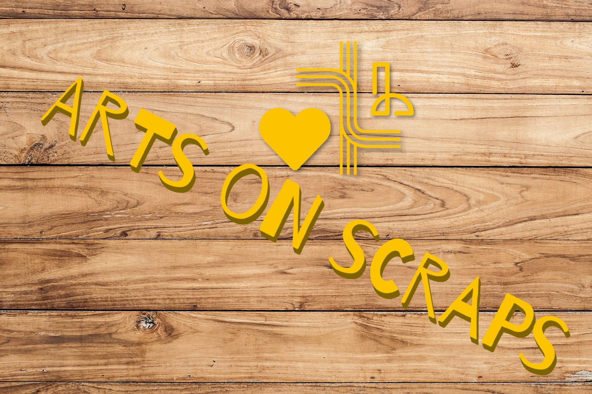

# Recycle-to-Art
Αποθετήριο του σχολείου "Εσπερινό ΕΠΑΛ Αλιάρτου" για στην συμμετοχή στον Διαγωνισμό Ανοιχτών Τεχνολογιών

**Ομάδα:**  " Arts on Scraps " (Οι μαθητές της **Γ πληροφορικής** του Εσπερινού ΕΠΑΛ Αλιάρτου 

**Σχολείο:** Εσπερινό ΕΠΑΛ Αλιάρτου

**Τίτλος έργου:** «Νέα Ζωή-Νέα Πνοή : Μετατρέποντας τα σκουπίδια σε τέχνη»

______

# Εποπτικό Διάγραμμα του Συστήματος

___

______

# ΑΡΧΙΚΗ ΠΡΟΤΑΣΗ ΤΟΥ ΕΡΓΟΥ

___

Παρακάτω περιγράφεται η πρόταση έργου για την συμμετοχή της ομάδας μας ,**" Arts on Scraps "**, στον «4ο Πανελλήνιο Διαγωνισμό Ανοιχτών Τεχνολογιών στην Εκπαίδευση»

## Εισαγωγή - Περιγραφή

Στην παρούσα πρόταση, η ομάδα μας προτείνει την κατασκευή ενός συστήματος, που επαναχρησιμοποιεί  υλικά του σχολείου μας που προορισμός τους είναι ο κάδος απορριμάτων.

Πιο συγκεκριμένα, το παραπάνω γίνεται δυνατό μέσω των παρακάτω δράσεων :

 1. **Δράση 1 -  Ανακύκλωση εξαρτημάτων για την κατασκευή**  : Την επαναχρησιμοποίηση εξαρτημάτων από  παλαιό ηλεκτρονικό εξοπλισμό που προορίζεται για  απόσυρση (π.χ  παλιοί ηλεκτρονικοί υπολογιστές cd-rom Drive φωτοτυπικά μηχανήματα  κ.τ.λ)

2.  **Δράση 2 -  Ανακύκλωση Αναλωσίμων ως πρώτη ύλη**  : Προωθούμε την χρήση  απορριπτέων αναλωσίμων (όπως  χαρτί ,  ξυλεία,   μεταλλικά ελάσματα , χαρτόνια  συσκευασιών  κ.τ.λ)  ως πρώτη ύλη για τις δικές μας δημιουργίες.

# Τι παρόμοιο υπάρχει - Τρέχουσα αντιμετώπιση προβλήματος

Στην προσπάθειά μας να ερευνήσουμε την τρέχουσα κατάσταση και να παρατηρήσουμε τι λύσεις υπάρχουν σε παρόμοια προβλήματα καταλήξαμε στις παρακάτω διαπιστώσεις:

- Αν και υπάρχουν θεσμοθετημένες  αρκετές  διαδικασίες ανακύκλωσης απορριπτέων αναλωσίμων,  στην πράξη αυτές **δυσλειτουργούν** με αποτέλεσμα μεγάλος όγκος από αυτό να καταλήγει σέ μη κατηγοριοποιημένα και μη επαναχρησιμοποίησιμα απορρίμματα.
- Έλλειψη υποδομών και διαδικασιών για την ανακύκλωση αρκετών υλικών όπως ξυλεία (βάσεις από παλιές κατασκευές,  κατεστραμμένα θρανία , υλικών συσκευασίας, κ.τ.λ),  με παρόμοιο αποτέλεσμα,  δηλαδή την ανεξέλεγκτη απόρριψη μεγάλου όγκου απορριμμάτων.
- Αν και υπάρχουν αρκετοί  σχεδιoγράφοι (plotters),  κυρίως **προορίζονται για τη σχεδίαση σε καθαρό  χαρτί** και δεν μπορούν να σχεδιάσουν στα υλικά που εμείς προτείνουμε
- Παρόμοιοι  σχεδιoγράφοι (plotters)  πού μπορούμε να βρούμε στο διαδίκτυο υπό τη μορφή ιδιοκατασκευών DIY,  παρουσιάζουν κάποια μειονεκτήματα που εμείς προσπαθούμε να επιλύσουμε όπως :

 	- προσαρμογή σε **διάφορα υλικά**

	- δικτύωση για να είναι **προσβάσιμοι από απόσταση**
	-  ρυθμιζόμενης **επιφάνειας σχεδιασμού**

	-  προσανατολισμό στην δημιουργία **εκπαιδευτικής διαδικασίας**

	-  προσανατολισμό στην  εκμαιεύση  **καλλιτεχνικών δυνατοτήτων**

# Αναγκαιότητα του έργου-Στόχοι

Σύμφωνα με την ανάλυση των δεδομένων που παρουσιάστηκαν στην προηγούμενη παράγραφο, προέκυψε η ιδέα και η πρόταση για το παρόν σύστημα.

Πιο συγκεκριμένα το σύστημα που προτείνουμε έχει τα παρακάτω χαρακτηριστικά τα οποία προσπαθούν να λύσουν τα προβλήματα που προέκυψαν κατά την έρευνά μας. Τα προτεινόμενα και επιθυμητά χαρακτηριστικά είναι τα εξής:

 - Στην δημιουργία διαδικασιών εντός του σχολείου μας που να οδηγούν στην απόρριψη λιγότερων σκουπιδιών  και απορριμμάτων
 - Στην δημιουργία  κλίματος και Πνεύματος στην εκπαιδευτική κοινότητα που να προωθεί την ανακύκλωση και την προστασία του περιβάλλοντος
 - Στην δημιουργία  κλίματος και πνεύματος στην εκπαιδευτική κοινότητα που να προωθεί την ανακύκλωση και την προστασία του περιβάλλοντος
 - Την αφύπνιση και υποβοήθηση καλλιτεχνικών δεξιοτήτων και ικανοτήτων των μαθητών 
 - Στην κατασκευή σχεδιoγράφου (plotter)  κατάλληλου για χρήση σε  ανακυκλώσιμα υλικά  και  πρακτικά προσβάσιμου  σε όλο το σχολείο
 - Την προσθήκη ενός ακόμη χρήσιμου εργαλείου πολλαπλής χρήσης στο εργαστήριο του σχολείου
 - Την αποσυμφόρηση  και απελευθέρωση χωρών του σχολείου με την ταυτόχρονη επαναχρησιμοποίηση πεπαλαιωμένων υλικών

 

---

# Δομή - Χρήση- Υλοποίηση του συστήματος

---

Το σύστημα περιλαμβάνει τα ακόλουθα μέρη:

1. Κεντρικός Σταθμός Ελέγχου - Raspberry Pi 4)
2. Σχεδιoγράφος (plotter)
3. Δικτυακή Υποδομή

---

#Κύρια Χαρακτηριστικά

---
- Στο Hardware  και στο software θα γίνεται χρήση αποκλειστικά ανοιχτών τεχνολογιών  και ανοιχτού λογισμικού (Raspberry Pi, Arduino, Inkspace, Blender, κτλ)
- Ο Σχεδιoγράφος (plotter)  θα μπορεί να σχεδιάζει σε χάρτι διαφόρων μεγεθών,  χαρτόνια συσκευασίας,  ξύλο και μέταλλο
-  Ο Σχεδιoγράφος Θα είναι προσβάσιμος από τους μαθητές όλων των εργαστηρίων του σχολείου
- Ο κεντρικός σταθμός  θα διαχειρίζεται λογαριασμός των διαφόρων χρηστών, δίνοντάς τους τα κατάλληλα δικαιώματα
- Ο κεντρικός σταθμός θα  αρχειοθετεί  και οργανώνει τις δημιουργίες των μαθητών
- Ο κεντρικός σταθμός θα είναι υπεύθυνος για ανανέωση του firmware  του σχεδιoγράφου   καθώς και λοιπές εγκαταστάσεις προγραμμάτων απαραίτητων  για την ολοκλήρωση του έργου της σχεδίασης
- Το όλο σύστημα  στα σχεδιαστεί  έτσι ώστε να παρέχεται   η μέγιστη επεκτασιμότητα  και θα ακολουθεί λογική αρθρωτού  σχεδιασμoύ

---

# Υλικά - λίστα των υλικών

---

Το σύστημα που προτείνεται είναι αρθρωτό και μπορεί να υλοποιηθεί με τρεις κλιμακούμενες διαμορφώσεις. Το προϋπολογιζόμενο κόστος κυμαίνεται από 298 έως 125 ευρώ, με προτεινόμενο το πλήρες σύστημα

Αναλυτικότερα το κοστος και τα υλικά :

---

# Κατασκευή

---

---

# Μελλοντικές επεκτάσεις

---

---

- Επέκταση και δυνατότητα προγραμματισμού  ή  αυτοματισμού με Scratch , με σκοπό  την χρήση του από μικρότερες τάξεις και μαθητές μικρότερης ηλικίας  καθώς και την εισαγωγή τους στην έννοια των  CNC μηχανών  και ρομποτικών κατασκευών
 - Επέκταση και δυνατότητα προγραμματισμού  ή  αυτοματισμού με python , με σκοπό  την χρήση  κατά τη διαδικασία  εκμάθησης της δημοφιλούς γλώσσας , η οποία είναι και μέρος του αναλυτικού προγράμματος

---

#Κοινωνική επίδραση

---
---

Παρακάτω παραθέτουμε το  λογότυπο - Logo της ομάδας μας που ελπίζουμε να είναι η πρώτη μας κατασκευή!!!

