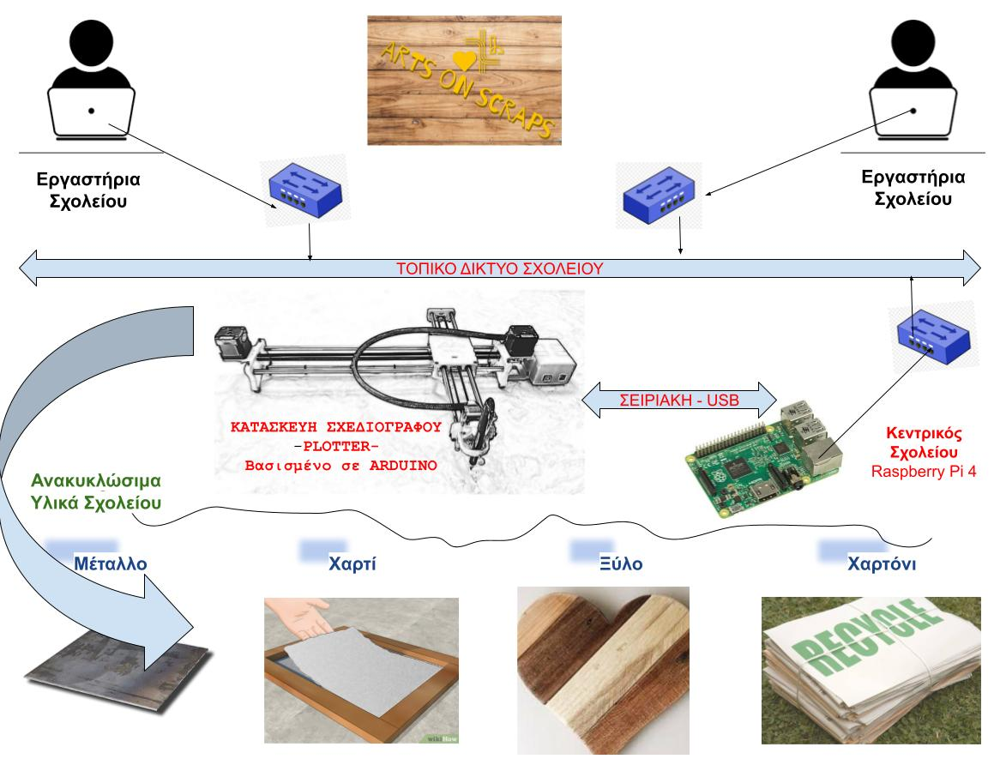

# recycle-to-art
Αποθετήριο του σχολείου "Εσπερινό ΕΠΑΛ Αλιάρτου" για στην συμμετοχή στον Διαγωνισμό Ανοιχτών Τεχνολογιών

**Ομάδα:**  " Arts on Scraps " (Οι μαθητές της **Γ πληροφορικής** του Εσπερινού ΕΠΑΛ Αλιάρτου 

**Σχολείο:** Εσπερινό ΕΠΑΛ Αλιάρτου

**Τίτλος έργου:** «Νέα Ζωή-Νέα Πνοή : Μετατρέποντας τα σκουπίδια σε τέχνη»

______

# Εποπτικό Διαγραμμα του Συστήματος

___

___

